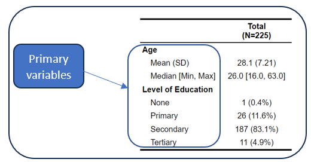
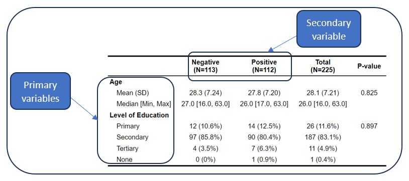
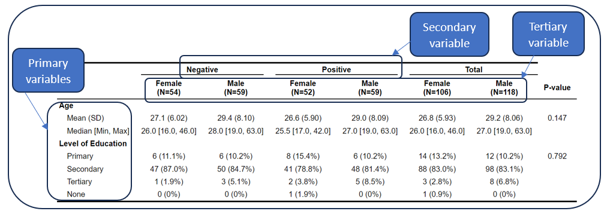

# Stats Reporter

This app generates reports in .docx, .htlm, or .pdf for basic descriptive statistical analyses:

### Univariate analysis

The univariate analysis entails reporting frequencies and percentages of a primary categorical variable, or means, medians, standard deviation, minimum, maximum, and standard error of mean of a primary numerical variables. Such a table is shown below.

### Bivariate analysis

The bivariate analysis entails reporting frequencies and percentages of a primary categorical variable, or means, medians, standard deviation, minimum, maximum, and standard error of mean of a primary numerical variable by categories of another grouping variable (secondary variable). The analysis also reports test statistics (Chi-square is used when primary variable is categorical, while Kruskal-Wallis is used when the primary variable is numeric.) Such a table is shown below.

### Trivariate analysis

The trivariate analysis entails reporting frequencies and percentages of a primary categorical variable, or means, medians, standard deviation, minimum, maximum, and standard error of mean of a primary numerical variables by categories of two grouping variables (secondary and tertiary variables). The analysis also reports test statistics (Chi-square is used when primary variable is categorical, while Kruskal-Wallis is used when the primary variable is numeric.). The trivariate analysis report is only available in .html and .pdf formats. Such a table is shown below.

