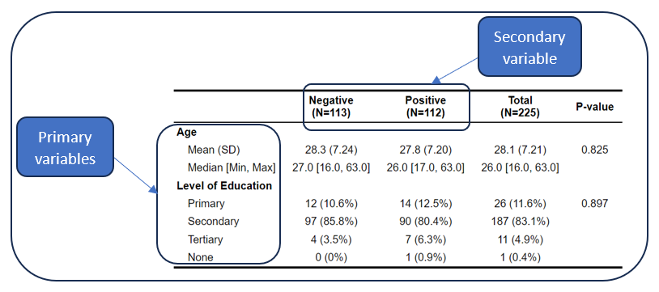

# About QSR

**QSR** (Quick Stats Reporter) is an extremely useful R/Shiny web application for quick data analysis and reporting. It determines on its own what kind of table and graph to generate depending on the type of variable(s) selected. It generates tabular reports in `.csv`, `.pdf`, `.docx`, `.htlm`, or `.pdf` and graphical reports in `.png`, `.pdf`, and `.svg` formats for the following basic descriptive statistical analyses:

### Univariate analysis

The univariate analysis entails reporting frequencies and percentages of a primary categorical variable, or means, medians, standard deviation, minimum, maximum, and standard error of the mean of a primary numerical variable. Such a table is shown below.

### Bivariate analysis

The bivariate analysis entails reporting frequencies and percentages of a primary categorical variable, or means, medians, standard deviation, minimum, maximum, and standard error of the mean of a primary numerical variable by categories of another grouping variable (secondary variable). The analysis also reports test statistics (Chi-square is used when the primary variable is categorical, while Kruskal-Wallis is used when the primary variable is numeric.) Such a table is shown below.

### Trivariate analysis

The trivariate analysis entails reporting frequencies and percentages of a primary categorical variable, or means, medians, standard deviation, minimum, maximum, and standard error of the mean of a primary numerical variable by categories of two grouping variables (secondary and tertiary variables). The analysis also reports test statistics (Chi-square is used when the primary variable is categorical, while Kruskal-Wallis is used when the primary variable is numeric.). The trivariate analysis report is only available in .html and .pdf formats. Such a table is shown below.

